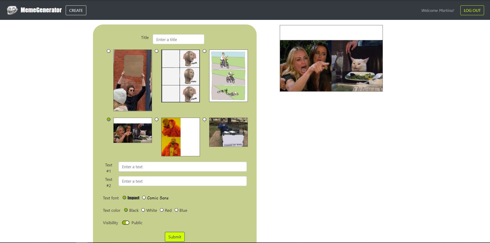

# Exam #2: "Generatore di meme"
## Student: s279778 PROVENZANO ADRIANA 

## React Client Application Routes

- Route `/`: main page of the application web, it displays all the published memes if the current user is authenticated. If the user is not logged, it displays only the public (not protected) memes.
- Route `/login`: login page of the application, not logged user needs to complete username and password fields to get authenticated. 
- Route `/create`: this page allows the user to create a new meme (100% original or copied by another meme), the user needs to choose a title, an image, one or more text, a color, a font and if the meme will be protected or not. 

## API Server

- POST `/api/sessions`
  - request body content: {username: "adriana97", password: "adriana97"}
  - request parameters: *none*
  - response body content: 
    ```json
      {
        "id":1,
        "username":"adriana97",
        "name":"Adriana"
      }
    ```
    <br />In case of not valid credentials: status code 401 Unauthorized, response body content {"message":"Incorrect username and/or password."}

- DELETE `/api/sessions/current`
  - request body content: *none*
  - request parameters: *none*
  - response body content: *none*

- GET `/api/sessions/current`
  - request body content: *none*
  - request parameters: *none*
  - response body content: 
    ```json
      {
        "id":1,
        "username":"adriana97",
        "name":"Adriana"
      }
    ```

- GET `/api/users/:id`
  - request body content: *none*
  - request parameters: 3 (http://localhost:3001/api/users/3)
  - response body content: 
    ```json
      {
        "id":3,
        "username":"aw2021",
        "name":"Enrico"
        }
    ```
    <br />In case of not existing user: status code 404 Not Found, response body content {"error":"User not found."}.
    <br />In case of a not valid symbol as parameter: status code 422 Unprocessable Entity, response body {"errors":[{"value":"x","msg":"Invalid value","param":"id","location":"params"}]}

- GET `/api/templates`
  - request body content: *none*
  - request parameters: 3 (http://localhost:3001/api/users/3)
  - response body content: 
    ```json
      [
        {
          "id":1,
          "image_path":"./meme/meme1.png",
          "num_field":1,
          "position_text1":"meme1-text1",
          "position_text2":null,
          "position_text3":null
        },
       //...
      ]
    ```

- GET `/api/templates/:id`
  - request body content: *none*
  - request parameters: 3 (http://localhost:3001/api/templates/3)
  - response body content: 
    ```json
      {
        "id":3,
        "image_path":"./meme/meme3.png",
        "position_text1":"meme3-text1",
        "position_text2":"meme3-text2",
        "position_text3":"meme3-text3"
      }
    ```
    <br />In case of not existing template: status code 404 Not Found, response body content {"error":"Template not found."}
    <br />In case of a not valid symbol as parameter: status code 422 Unprocessable Entity, response body {"errors":[{"value":"x","msg":"Invalid value","param":"id","location":"params"}]}  

- GET `/api/memes`
  - request body content: *none*
  - request parameters: *none*
  - response body content: if the user is logged
    ```json
      [
        //...
        {
          "id": 2,
          "title": "Captain Obvious",
          "protect": 1,
          "text1": "This is a sign",
          "text2": null,
          "text3": null,
          "color": "white",
          "font": "impact",
          "template": 1,
          "creator": 3
          },
        //...
      ]
      ```
    <br />If the user is not logged: status code 401 Unauthorized, response body content {"error":"not authenticated"}

- GET `/api/public/memes`
  - request body content: *none*
  - request parameters: *none*
  - response body content: 
    ```json
      [
        {"id":1,
        "title":"Marketing basics",
        "protect":0,
        "text1":"10.00 €",
        "text2":"9.99 €",
        "text3":"",
        "color":"black",
        "font":"impact",
        "template":5,
        "creator":3
        },
        //...
      ]
    ```

- GET `/api/memes/:id`
  - request body content: *none*
  - request parameters: 7 (http://localhost:3001/api/memes/7)
  - response body content: if the user is logged and the meme is protected 
    ```json
      {
        "id":7,
        "title":"Only for few... ",
        "protect":1,
        "text1":"10 + 10 = 20",
        "text2":"10 + 10 = 100",
        "text3":"",
        "color":"black",
        "font":"comic",
        "template":5,
        "creator":1
      }
    ```
    <br />If the user is not logged and the meme is protected: status code 401 Unauthorized, response body content {"error":"Unauthenticated user and meme protected!"}

- POST `/api/memes`
  - request body content: 
    ```json
      {
        "color": "red",
        "font": "comic",
        "protect": 1,
        "template": 6,
        "text1": "Milk is just cow juice",
        "text2": "",
        "text3": "",
        "title": "It's a matter of juice "
      }
    ```
  - request parameters: *none*
  - response body content: *none*
    <br />If the user is not logged: status code 401 Unauthorized, response body content {"error": "not authenticated"} 
    <br />If the posted meme contains an error: status code 422 Unprocessable Entity, response body content {"errors": ["body[color]: Invalid value"]} 

- DELETE `/api/memes/:id`
  - request body content: *none*
  - request parameters:  10 (http://localhost:3001/api/memes/10)
  - response body content: 
      {}
    <br />If the id does not match with any meme, the status code is 200 (OK) but it does really not delete any meme. 

## Database Tables

- Table `users` - contains id, username, hash, name
  <br />it contains all the needed information about the users of the web application. 
- Table `memes` - contains id, title, protect, text1, text2, text3, color, font, template, author
  <br />it contains information about the published memes, the template used and the creator id.
- Table `templates` - contains id, image_path, num_field, position_text1, position_text2, position_text3
  <br />it contains information about the standard images that can be used for creating memes, how many text fields the user is allowed to insert and where they are positioned. 
  The values attributes *position_text1*. *position_text2* and *position_text3* find a match with one of the CSS classes contained in the file App.css. 

## Main React Components

- `Main` (in `App.js`): it contains most of the application logic, it offers methods for adding or deleting a meme, it has the responsibility of loading memes and templates and of managing the user state, and it allows the user to go from one page to another by means of its switch component. 
- `LoginForm` (in `LoginComponent.js`): it contains the form where the user can write his/her username and password, if everything is correct the user is authenticated. 
- `MemeComponent` (in `MemeComponent.js`): it receives as props all the properties of a meme (color, font, text, ...) and all the templates and it has the responsability of showing the complete meme. 
- `MemeForm` (in `MemeForm.js`): it allows the user to create its own meme or to modify something of a copied meme. The user has to choose a title, an image, some texts, a color and a font for the texts and if the meme will be protected or not. 
- `MyMemeList` (in `MyMemeList.js`): it contains a MemeRow for each published memes, a MemeRow in turn is composed by a MemeData which shows the title of a meme, and a MemeControl to copy or deleting a meme. If the user clicks on a meme title a Modal with all the meme details is shown. 
- `MyNavBar` (in `MyMemeList.js`): it shows the web application logo and title and it contains login/logout button, a welcome message and a button for opening the MemeForm. 

## Screenshot



## Users Credentials

- *username: adriana97, pwd: adriana97, name: Adriana* 
  <br />She published memes: "Students' hard life" (id 5), "Alphabet" (id 6), "Only for few..." (id 7, copied from meme with id 1)
- *username: user1234, pwd: user1234, name: Martina*
  <br />She published memes: "#1 Worker" (id 3), "Flat troubles" (id 4), "It's a matter of juice" (id 8, copied from meme with id 6)
- *username: aw2021, pwd: aw2021, name: Enrico*
  <br />He published memes: "Marketing basics" (id 1), "Captain obvious" (id 2), "Under the sea" (id 9, copied from meme with id 3)
